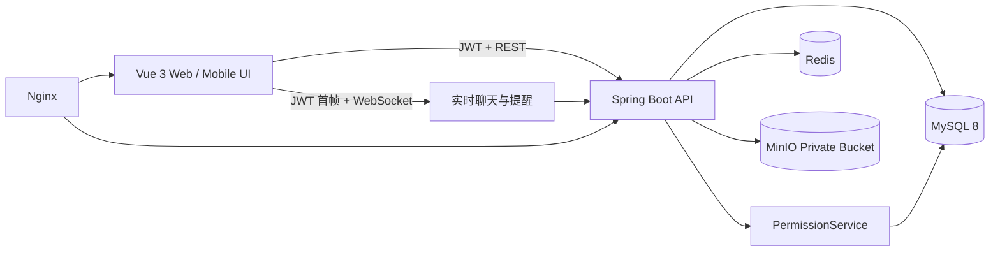

# 拾光空间 MemoSpace

> 每个人拥有自己的私人记忆库，也可以和重要的人共同建立一段只属于彼此的数字空间。

MemoSpace 不是后台管理系统，也不是把照片塞进文件夹的工具。它把个人记忆、公开动态、关系绑定、共同空间与时间轴放进同一个生活化产品里，同时在后端严格守住私人内容的访问边界。

## 已完成能力

- 注册、登录、JWT、完整资料编辑、头像上传与密码修改
- 自动分配唯一的 12 位纯数字 Memo ID；普通用户不能自行修改，管理员可在获得本人请求后协助调整
- Memo ID 精确搜索、好友申请/接受/拒绝、好友备注、删除、拉黑与单人权限设置
- 好友与关系绑定相互独立：好友负责聊天和日常提醒，关系负责分类与共同空间
- WebSocket 一对一实时聊天、在线状态、断线重连、消息持久化、已读与历史分页
- 生日、纪念日、任务、计划等单次/周期提醒，支持图片、好友确认、共同关系与站内到期通知
- 注册后自动创建私人空间
- Memory 文字/照片/视频/地点/混合类型，单主体多空间关联
- PRIVATE / RELATIONSHIP / PUBLIC / CUSTOM 后端权限判断
- 用户搜索、关注、最新/关注公共 Feed
- 独立关系分类：恋人、死党、闺蜜、家人四个默认分类，以及自定义、隐藏/恢复、排序
- 搜索用户、选择分类、邀请、接受/拒绝、关系管理与解除；同一关系可有多个标签但只保留一个共同空间
- 好友申请、好友接受、关系申请和关系接受实时送达，列表与未读状态自动刷新
- 重复邀请、自我绑定、过期邀请、越权操作拦截
- 关系空间时间轴、成员、统计、留言、事件与纪念日增删改、倒计时及年度提醒联动
- 解除关系后封存空间，不删除 Memory 历史
- 评论、Reaction、收藏与通知
- 本地/MinIO 双存储；UUID、魔数 MIME 检测、大小限制、路径防穿越，以及鉴权后的媒体流式代理
- 相册、可展开当天 Memory 的日历、记忆地图、全局搜索、响应式移动导航
- Web 与 Android 在用户主动授权后读取一次当前坐标，可写入地点 Memory，并在记忆地图标出当前位置
- 8 套低饱和主题，支持账号与关系空间分别自定义颜色、背景图片、亮度和遮罩，并自动分析图片明暗改善文字可读性
- Memory/评论举报、证据快照与处理进度；管理员可删除被举报内容、警告、禁言 7 天、封号或解除限制
- 独立管理员登录与管理中心，只开放账号管理、举报目标证据和操作审计；不能浏览未被举报的 Memory、空间、聊天或媒体
- 用户/管理员登录滑动切换，以及带无障碍降级的轻量页面过渡动画
- Flyway 版本化数据库迁移；已有 MySQL 卷首次升级会建立迁移历史并保留原数据
- Swagger、MySQL、Redis、MinIO、Nginx 和 Docker Compose

## 最快启动

机器已安装 Docker Desktop 时，在项目根目录运行：

```bash
docker compose up -d --build
```

Windows 也可以在 Docker Desktop 已启动后直接双击项目根目录的 `启动拾光空间.cmd`；脚本会启动整套服务并打开浏览器。

Docker 生产前端使用多阶段构建：Node/npm 只负责执行 Vue 构建，最终静态文件由 Nginx 提供，并由 Nginx 将 `/api` 反向代理到后端；不是长期运行 `npm run dev`。

打开：

- Web 产品：<http://localhost:3000>
- 管理员入口：<http://localhost:3000/admin/login>
- API 文档：<http://localhost:18081/swagger-ui.html>
- MinIO 控制台：<http://localhost:9001>

首次构建需要下载镜像和依赖。MySQL 健康检查通过后，打开 Web 产品并注册第一个普通用户即可开始使用；默认不会创建演示账号。

## 默认账号与密码

这些值只用于本地体验。正式部署前请复制 `.env.example` 为 `.env` 并全部替换。

| 用途 | 账号 | 默认密码 |
|---|---|---|
| 本地管理员 | `admin` | `MemoAdmin2026!` |
| MySQL 应用用户 | `memospace` | `memospace_db_2026` |
| MySQL root | `root` | `root_memospace_2026` |
| Redis | 无用户名 | `memospace_redis_2026` |
| MinIO | `memospace_minio` | `memospace_minio_2026` |

还需要替换 `.env` 中的 `JWT_SECRET` 和管理员密码。需要多个管理员时设置 `ADMIN_ACCOUNTS=账号|密码|昵称;账号|密码|昵称`；一旦填写，就不会再创建表格中的单个兼容账号。管理员只在账号不存在时创建，后续修改环境变量不会覆盖数据库中的现有密码。密码更改后执行 `docker compose up -d --build` 使配置生效。若已有 MySQL 数据卷，修改数据库初始化密码不会重写旧用户；不要为了升级功能删除数据卷。

数据库结构由 `backend/src/main/resources/db/migration` 中的 Flyway 脚本管理。旧部署第一次升级前先备份 MySQL；启动后会把原结构标记为 V1，再执行 V2 及更高版本，无需重新建库。详情见 `sql/README.md`。

## 不使用 Docker 的本地开发

本地后端默认使用文件型 H2 和本地私有文件目录，因此 MySQL、Redis、MinIO 未启动也可以调试主流程：

```bash
cd backend
mvn spring-boot:run
```

另开终端：

```bash
cd frontend
npm install
npm run dev
```

浏览器打开 <http://localhost:5173>。本地 H2 数据保存在 `backend/data`；默认是空账号库，需要从注册页创建用户。自动化测试可在测试配置中显式开启演示数据。

## 架构



后端保持单体模块化结构，避免 V1 过早引入微服务。MyBatis-Plus 用于实体映射和基础数据访问，复杂的权限/聚合查询通过参数化 SQL 完成。

## 核心数据设计

`memory` 保存唯一的记忆主体，`memory_space` 决定同一条 Memory 出现在哪些空间，避免同步时复制内容。`space_member` 是空间访问权的事实来源。公开展示由独立 `post` 记录控制，使“私人历史”与“公开发布状态”可以分别演化。

核心表：`user_account`、`friend_request`、`friendship`、`friend_setting`、`direct_message`、`reminder`、`reminder_participant`、`reminder_delivery`、`user_follow`、`relationship_invitation`、`relationships`、`relationship_category`、`relationship_category_link`、`space`、`space_member`、`memory`、`memory_space`、`memory_media`、`notification`、`file_record`、`content_report`、`admin_audit_log`。

## 权限设计

所有读取和写入都以 JWT 中的用户 ID 为入口，由 `PermissionService` 统一判断：

- 私人 Memory：仅创建者
- 关系 Memory：创建者或任一关联空间成员
- 公开 Memory：所有已登录用户
- 自定义 Memory：创建者与 `memory_custom_viewer` 指定用户
- 空间写入：必须是空间成员且空间状态为 `ACTIVE`
- 修改/删除 Memory：仅创建者
- 私有媒体：拥有者，或对挂载 Memory 具有读取权限的人
- 管理员会话：只能调用 `/api/admin/**`；只能读取用户主动举报的目标文本和与该目标 Memory 绑定的证据媒体，不能浏览其他内容
- 被封号账号不能登录，已签发会话也会被拦截；禁言期间可浏览，但不能发布 Memory、评论、关系空间留言或聊天消息

测试覆盖了他人私密 Memory 访问拦截、管理员内容边界，以及封存关系空间后的写入拦截。更多说明见 `docs/security.md`。

## 项目结构

```text
memo-space/
├── backend/                 Spring Boot 3 / Java 17
├── frontend/                Vue 3 / TypeScript / Vite
├── sql/                     数据库说明
├── docs/                    架构、API、安全与项目复盘
├── docker-compose.yml       MySQL + Redis + MinIO + Backend + Frontend
├── .env.example             所有可替换账号与密钥
└── README.md
```

## 构建与测试

```bash
cd backend
mvn clean package

cd ../frontend
npm ci
npm run build
```

后端 24 项测试覆盖关系分类、多标签单空间复用、三种 Memory 媒体权限、Memo ID、好友权限、聊天持久化、提醒周期/投递、重要日期、管理员隔离、举报处罚，以及“已有数据库保留数据并由 V1 升到 V2”。浏览器自动化还覆盖手机连续导航、好友搜索、当前定位、地点 Memory、举报提交与进度、管理员核查视频证据和处罚、封号旧会话退出。当前先稳定 Web 产品，Android 工程保留但不作为本轮交付内容。

## 接口文档

启动后访问 Swagger。常用接口摘要见 `docs/api.md`。

## 截图位置

后续产品截图可放进 `docs/screenshots/`：首页、个人空间、关系空间、时间轴、相册、地图和年度回忆。当前 V1 已完成对应页面布局，年度回忆与 AI 总结仍属于需求文档中的 V2/V3 范围。

## 后续阶段

下一阶段：Web Push、Android / iPhone 系统通知、完整地图瓦片、年度回忆、图片缩略图异步处理、Feed 游标分页。

V3：只读式 AI 总结与智能标签；AI 不能修改原始历史。
